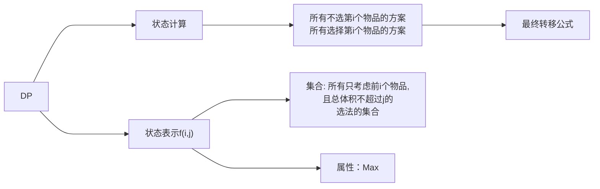

## 数位DP

[TOC]

### 核心

特性（数位） + 预处理 + 刷题（熟练度）

可以看作一种剪枝手段

数位 -> 核心在于**数**和**位**，将数拆分成位，从高到低开始枚举，每一位我们都可能有若干种选择，数位DP就是在极大的剔除每一位的某几种选择（即记忆化削减）

那么通过[闫式DP分析法](###拓展：闫式DP分析法)可知，所有的DP问题都可以通过**化零为整，化整为零，最后不同**三步走，故也对此做相关的讲解，见[拓展>数位DP](######数位DP)


### 基本应用场景

给定闭区间`[l,r]`, 让你求这个区间的某种数字性质（数字和、出现次数、禁止子串、位限制…），由于直接遍历的效率过低，我们将其分割为一个个子集合（即每一位每一位的选择，不同的选择产生不同的类别）

**伪代码**

```c++
int ans = 0;
fer(i, l, r+1) {
    if (check(i))ans++;
}
```

很显然，主要是针对这个check，我们用什么方式快速地去遍历区间里的数

### **DP思想引入**

**伪代码（来源于AI）**

```c++
dfs(pos, tight, lead, extra...):
    若 pos == len:          // 所有位决定完毕
        return 是否满足性质
    if (!tight) 且 该状态已算:
        return 记忆值
    upper = tight ? digit[pos] : 9
    ans = ∑_{d=0}^{upper}
          dfs(pos+1,
              tight && d==upper,
              lead && d==0,
              extra_update(d))
    if (!tight) 记忆 ans
    return ans
```

- `digit[]`：把上界 \(N\) 拆成数组，最高位在前  
- `tight`：前缀是否刚好贴着上界  
- `lead` ：目前是否全是前导零  
- `extra`：题目自定义（数字和、出现过 7、上一位…）  

区间 \([L,R]\) 用 `solve(R) - solve(L-1)` 获得。

### 详细例题

##### 1. **数的度量**

【题意】

给定X,Y,K,B, 问在区间`[X,Y]`，多少个数满足`值等于K个互不相同的B的整数次幂之和`条件

【思路】

数位DP，将[x,y]中每个数转为B进制数，如果它的每一位只能是 0/1，且 1 的总数正好是 \(K\)，那它就满足题意。  

于是，转换为模板的题型为：
统计 \([0,N]\) 内 **\(B\) 进制仅含 \(0/1\) 且 1 的个数 = K** 的数的个数

【套模板】

###### 维度变量

1. `pos`     ：当前位  
2. `ones`    ：已放入的 1 的个数（0～K）  
3. `tight`   ：是否还贴着上界  
4. `lead`    ：前导零标记

###### 转移  

- 本位可选 \(d = 0\) 或 \(1\)（若 `tight` 限制存在就最多到上界）  
- 更新 `ones' = ones + d`（注意前导零位放 0 不计数）  
- 末位判 `ones == K && !lead` 成功计 1

###### 区间答案

```
ans = solve(Y) - solve(X-1)
```

最终约2600个状态的遍历即可

【示例代码】

见[1.度的数量](../Problems/exampleQuestions.md###1.度的数量)

##### 2. 数字游戏（比较典型）

【题意】

求区间[a,b]中多少个数满足从左往右各位数字呈非下降关系

【思路】

数位DP，预处理f数组，用`f[i][j]`表示i位数，且最高位为j的不降数方案数

【示例代码】

见见[2.数字游戏](../Problems/exampleQuestions.md###2.数字游戏)

### 拓展：闫式DP分析法

#### 【具体思想】

核心思想：**集合**

所有的DP问题都可以看作是**有限集上的最值问题**

然而我们为什么要优化计算，是因为这个**有限集的数量级过高**，枚举成本过大

那么我们优化的路径是什么呢，闫式DP法给我们指明了两条道路与一个方法：

[^yc_cy1999/article/details/106106912]: 这里原帖已经讲的足够好，故直接粘贴

1. 化零为整，寻找共性——状态表示

   > 所谓 **化零为整** 是指我们对于零星的情况，不是一个一个去枚举，而是每次根据这些零星的情况的某些特性去枚举一类情况（即一个子集）
   > f(i)需要考虑的问题：
   >
   > - **表示的是一个怎样的集合**？
   > - **`f(i)`保存的值是什么意思(max/min/count/…)？与集合有什么关系?**

2. 化整为零，寻找不同——状态计算

   > 如何去求`f(i)`呢？
   > 我们要把它们划分成若干个不同的子集来求，每一个子集分别去求。需要满足的条件有：
   >
   > - 不重复（可以不满足，例如求`min`,`max`。但是求count的时候，就不能重复）
   > - 不遗漏
   >   例如，我们假设f(i)表示的是某个集合的最大值，那么可以每个子集的最大值的最大值。

3. 进行集合`f(i)`的**划分**——**寻找最后一个不同点**

#### 【具体例子】

###### **数位DP**

|               |                   | 在数位 DP 里的体现                 |
| ------------- | ----------------- | ---------------------------------- |
| 1. 化零为整   | 找共性 → 设计状态 | `pos, tight, lead ＋ 题目特有维度` |
| 2. 化整为零   | 找不同 → 状态计算 | 按「本位填什么数 d」把集合再拆分   |
| 3. 最后不同点 | 划分依据          | 正是“当前这一位放 0~9 哪个数”      |

【化零为整】

数位DP，可以看作集合S=[0,N]间所有整数，

枚举 S 会爆炸，所以先给 S 做“分层”——用若干下标（即所谓的状态）来刻画“已经处理的前缀”，

每一个状态，我们将满足：

1. 能唯一确定一个“子集合”；
2. 下标范围小，枚举快。

对应到状态转移方程`f(状态) ↔ S 的一个子集所对应的答案`, 因为把很多零散方案揉进同一个“子集合”，所以叫“化零为整”

【化整为零】

即：再把这个子集合拆开来

1. 想让 f(·) 可递推，就要把“当前子集合”继续__无交叉地拆成若干更小的子集__。最常用的拆分依据就是“最后一个不同点”——在所有方案里，找一处大家可能出现分歧的地方，把它作为分类标准‘

2. “最后一个不同点”：最后一个位置的数字；

   划分后要满足：

   - 不遗漏：所有方案都能落入某一类；

   - 尽量不重复：计数类必须互斥，最值类有重复也行（反正取 min/max）。

【写成转移】

让“子集答案”拼回“父集答案”
按上面拆分，父集合答案就是各子集合答案做 max/min/Σ：

```
f(i, j) = max( f(i-1, j),            // 不选
               f(i-1, j-w_i)+v_i )   // 选
```

【至此，“化零为整”+“化整为零”完整闭环】


###### **01背包**

再以01背包问题为例, 其集合和属性如下所示：



最后进行相应的优化手段即可（等价变形）

#### 【重要提醒】

1. “我要在什么集合上求什么东西？这个集合能用哪些下标切开？”

2. “在这些方案里，最后一个出现分歧的决定是什么？按它分类后能递推吗？”

3. 写公式时对照两条铁律：

   - 子集并 = 父集；

   - 计数要互斥，最值允许重叠。

4. 若枚举子集仍过大，就继续找“下一层最后不同点”，直到转移可承受，或引入优化结构（单调队列、状态压缩、AC 自动机等）。

